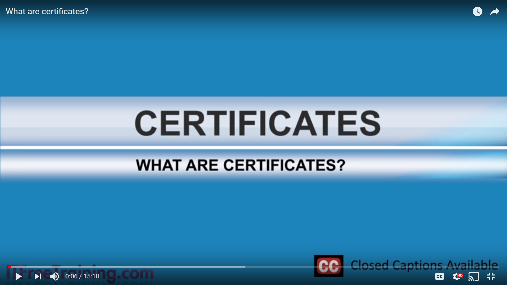
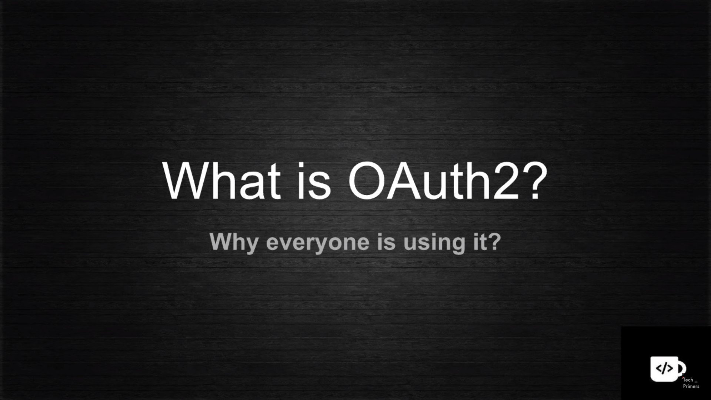
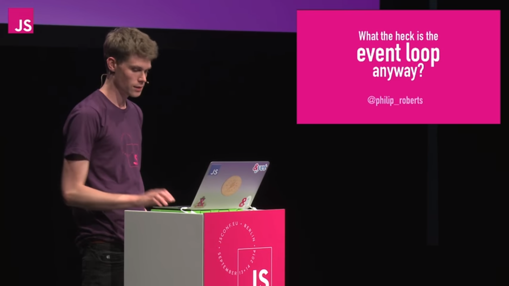
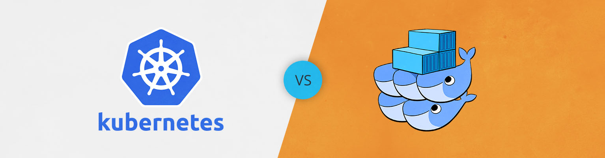

# my-references

## What are Certs?

## What is OAuth 2.0

## OAuth grant types
https://www.youtube.com/watch?v=1ZX7554l8hY

## Get started with Spring Boot by Josh Long

https://github.com/joshlong/bootiful-microservices

## What the heck is the Eventloop? by Philip Roberts

## Docker Swarm vs Kubernetes by Arun Gupta

## Deploy pod with Kubernetes using Helm
https://www.youtube.com/watch?v=xfdEXcN8vUY&t=32s

## Kubernetes Configmaps and Secretes
https://www.youtube.com/watch?v=N41ZwsORs_g&list=PLj_IGCS9P2SkmHxS8-i24azCIGEneJQrA&index=5

## What is the fun with istio?
https://www.youtube.com/watch?v=8OjOGJKM98o

https://github.com/thesandlord/Istio101

## Reactive Spring
https://www.youtube.com/watch?v=zVNIZXf4BG8&t=455s

## What is JWT token?
https://www.youtube.com/watch?v=67mezK3NzpU

## Machine Learning
https://www.youtube.com/watch?v=cKxRvEZd3Mw&list=PLOU2XLYxmsIIuiBfYad6rFYQU_jL2ryal

## Cloud Operations tools comparision
https://blog.gruntwork.io/why-we-use-terraform-and-not-chef-puppet-ansible-saltstack-or-cloudformation-7989dad2865c

## AWS workshop
https://www.youtube.com/watch?v=t4hDoMvxMWk&list=PLvmxnsCyoh64kn_H-7OJGubNMQhJzOmbh&index=1

## AWS Overview
https://www.youtube.com/watch?v=Z3SYDTMP3ME&t=1252s

## AWS API Gateway security mechanisams
https://www.youtube.com/watch?v=0T8WJ_xq8hU&list=PLGyRwGktEFqeqlHxUk6jVlbavPhiu9kP8&index=12&t=0s

## Terraform intro
https://www.youtube.com/watch?v=IxA1IPypzHs&feature=youtu.be

## Salt Stack demo
https://www.youtube.com/channel/UCuE6FxD86hgHhh_l5bK-1VQ

## DevOps tools comparision
https://blog.gruntwork.io/why-we-use-terraform-and-not-chef-puppet-ansible-saltstack-or-cloudformation-7989dad2865c

## Kubernetes guide with samples
https://www.youtube.com/watch?v=L_o_CG_AGKA&list=PLHq1uqvAteVtq-NRX3yd1ziA_wJSBu3Oj

## AWS cheat sheet
https://tutorialsdojo.com/aws-cheat-sheets/

